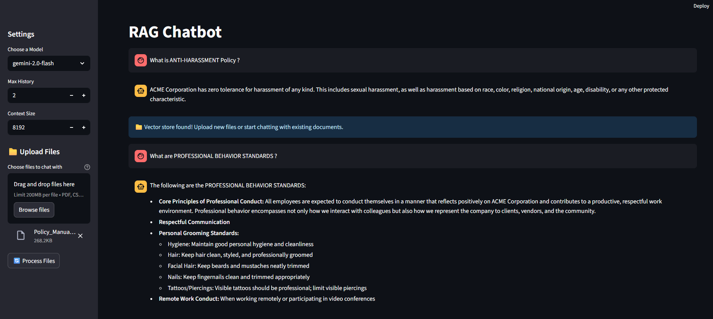

# RAG Chatbot with File Upload

A RAG (Retrieval-Augmented Generation) chatbot that allows you to upload files and chat with them using Streamlit and Google Gemini.

## Features

- 📁 **File Upload**: Upload PDF, CSV, and JSON files through the Streamlit UI
- 🤖 **Google Gemini**: Uses Google's Gemini models (gemini-2.0-flash, gemini-1.5-pro, gemini-1.5-flash)
- 🔍 **Vector Search**: ChromaDB for efficient document retrieval
- 💬 **Interactive Chat**: Chat interface with conversation history
- 📄 **Source Documents**: View source documents used for answers
- 🔑 **API Key Security**: Secure API key input through Streamlit UI

## Setup

1. **Install Dependencies**:
   ```bash
   pip install -r requirements.txt
   ```

2. **Setup Environment Variables**:
   - Copy `env_example.txt` to `.env`
   - Get your API key from [Google AI Studio](https://aistudio.google.com/)
   - Add your API key to the `.env` file:
     ```
     GOOGLE_API_KEY=your_actual_api_key_here
     ```

3. **Run the Application**:
   ```bash
   streamlit run main.py
   ```

**Note**: This version uses HuggingFace embeddings (sentence-transformers) for document processing and Google Gemini for chat responses. This combination avoids async event loop issues while providing excellent performance.

## Usage

1. **API Key**: The app will automatically load your API key from the `.env` file
2. **Upload Files**: Use the sidebar to upload PDF, CSV, or JSON files
3. **Process Files**: Click "🔄 Process Files" to create the knowledge base
4. **Start Chatting**: Ask questions about your uploaded documents
5. **View Sources**: Expand "📄 Source Documents" to see which parts of your files were used

## File Types Supported

- **PDF**: Text documents and reports
- **CSV**: Structured data files
- **JSON**: Configuration and data files

## Configuration

- **Model Selection**: Choose between different Gemini models (gemini-2.0-flash, gemini-1.5-pro, gemini-1.5-flash)
- **Context Size**: Adjust the context window size
- **Max History**: Control conversation history length
- **API Key**: Automatically loaded from `.env` file

## Files

- `main.py`: Main Streamlit application with file upload and chat functionality
- `chroma_store.py`: Utility functions for creating vector stores from files
- `test_upload.py`: Test script to verify functionality

## Troubleshooting

- Ensure you have a valid Google API key
- Check that all required packages are installed: `pip install -r requirements.txt`
- Verify file permissions for the chroma_db directory
- Check console output for error messages
- Make sure your API key has the necessary permissions for Gemini models

## Interface Preview


